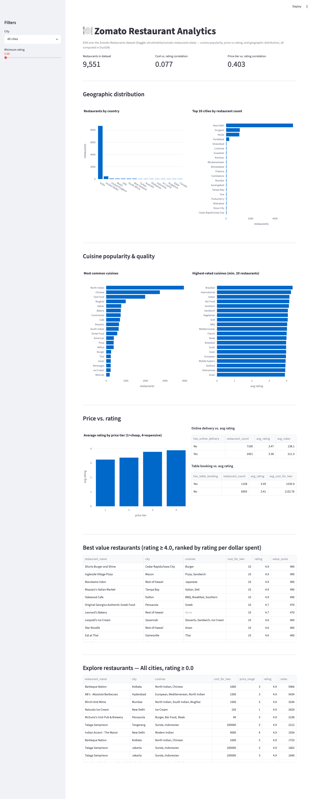

# 1. Zomato Restaurant Data Analysis

**Difficulty**: ⭐⭐ (Beginner) | **Est. time**: 2-3 weeks | **Best for**: first portfolio project, EDA fundamentals

An exploratory data analysis (EDA) project over real restaurant data: cuisine popularity, price vs.
rating, and geographic distribution. No modeling — the goal is to show you can extract clean,
business-relevant insight from a messy real-world dataset.

## Problem statement
A restaurant aggregator wants to understand its own marketplace: which cuisines are most popular
vs. highest-rated, whether price predicts quality, and which restaurants represent the best value.
You're handed the raw restaurant table and asked to answer those questions with evidence.

## Dataset
- **Kaggle**: [Zomato Restaurants Data](https://www.kaggle.com/datasets/shrutimehta/zomato-restaurants-data)
  (slug: `shrutimehta/zomato-restaurants-data` — note this differs from the slug commonly
  circulated online, `shrutimechlearn/...`, which no longer resolves)
- **Domain**: food delivery & restaurant analytics
- **Size**: 9,551 restaurants across 15 countries (~91% India, concentrated in Delhi NCR), 21 columns
- Ships with a bonus `Country-Code.xlsx` lookup table (the main CSV only has a numeric country code)

## Tech stack
| Layer | Tool |
|---|---|
| Storage / analysis | DuckDB (SQL) |
| Data access | Python (pandas, duckdb) |
| Visualisation (notebook) | Matplotlib, Seaborn |
| Visualisation (dashboard) | Streamlit, Plotly |

## How to run
```bash
# from the repo root, one-time setup (see root README for full details)
python -m venv .venv && source .venv/bin/activate
pip install -r requirements.txt

cd 01-zomato-restaurant-analysis
python download_data.py        # pulls the dataset into ./data/ via the Kaggle API
jupyter notebook analysis.ipynb # walk through the analysis
streamlit run app.py            # or launch the interactive dashboard
```

## Architecture
This project (like all 5 in this repo) is SQL-first:
- [`queries.sql`](./queries.sql) — every analytical query, as named blocks (`-- name: ...`).
  Standalone-readable; this is where the actual analysis logic lives.
- [`db.py`](./db.py) — a ~70-line helper that loads `zomato.csv` + `Country-Code.xlsx` into DuckDB
  and exposes `run_query(name, **params)`.
- [`analysis.ipynb`](./analysis.ipynb) — narrative walkthrough: runs each named query, charts it,
  and interprets the result.
- [`app.py`](./app.py) — a Streamlit dashboard calling the *same* named queries as the notebook.

## Analysis walkthrough & key findings
1. **Geographic distribution** — the dataset is ~91% Indian and dominated by Delhi NCR (New Delhi,
   Gurgaon, Noida). Any city/cuisine conclusion should be read as "true for Delhi NCR", not global.
2. **Cuisine popularity vs. quality diverge** — North Indian, Chinese, and Fast Food are the most
   *common* cuisines, but Brazilian, International, and Indian (as a standalone label) rate
   *highest* on average (min. 20 restaurants per cuisine, to avoid small-sample noise).
3. **Price vs. rating** — raw cost for two barely correlates with rating (Pearson r = 0.077), but
   Zomato's own 1-4 price *tier* correlates much more strongly (r = 0.403). Market segment predicts
   quality better than the sticker price does.
4. **Operational features** — restaurants with table booking rate noticeably higher on average
   (3.59 vs. 3.41) than those without; online delivery shows almost no relationship. Read as
   correlation (booking as a proxy for an established, higher-end restaurant), not causation.
5. **Best value** — a `rating / cost_for_two` score (restricted to restaurants already rated ≥ 4.0)
   surfaces high-quality, low-cost restaurants that a simple "top rated" list would miss.

## Skills demonstrated
- SQL: `UNNEST`/`string_split` to explode a delimited column, `CORR()`, `FILTER`, `HAVING` for
  small-sample-size guards, `CASE`-free tiered aggregation
- Data cleaning: correctly handling a sentinel value (`Aggregate rating == 0` means "unrated", not
  "rated zero")
- Correlation analysis and its limits (raw price vs. tiered price)
- Categorical + geographic aggregation
- Building a filterable Streamlit dashboard on top of parameterized SQL

## Dashboard preview


## Why recruiters love it
Real-world restaurant/food delivery data shows practical EDA skills on messy, real data — and the
"raw price barely predicts quality, but price tier does" finding is a genuinely non-obvious insight
you can talk through in an interview, not just a checklist of charts.
