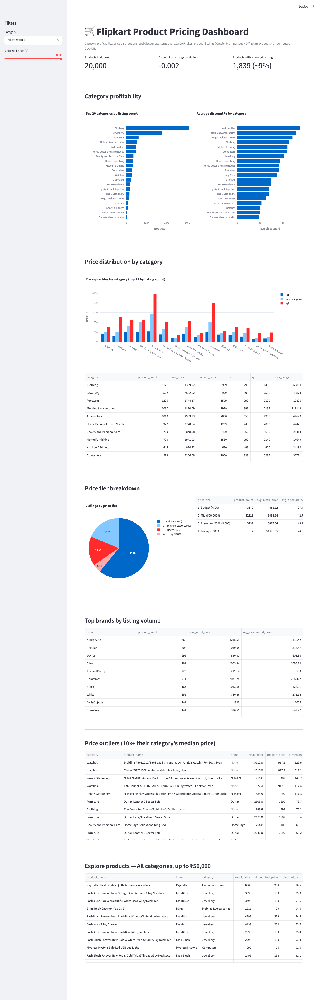

# 2. Flipkart Product Price Analysis

**Difficulty**: ⭐⭐⭐ (Intermediate) | **Est. time**: 2-3 weeks | **Best for**: pricing strategy, business acumen

A pricing-analytics project over 20,000 real Flipkart product listings: category profitability,
price percentiles, discount patterns, and price-outlier detection. Leans harder on SQL than project
1 — percentiles and window functions are the headline skills here.

## Problem statement
An e-commerce marketplace wants to understand its own pricing landscape: which categories carry the
deepest discounts, how price is distributed within each category, which brands dominate by listing
volume, and whether any listings are priced so far outside their category's norm that they're worth
a manual review.

## Dataset
- **Kaggle**: [Flipkart Products](https://www.kaggle.com/datasets/PromptCloudHQ/flipkart-products)
  (slug: `PromptCloudHQ/flipkart-products` — the doc's suggested slugs,
  `ybonda/flipkart-ecommerce-dataset` and `sazidthe1/flipkart-large-csv`, don't currently resolve
  on Kaggle; this is the closest well-established equivalent: 20k Flipkart listings with price,
  category, brand, and rating fields)
- **Domain**: e-commerce pricing & retail analytics
- **Size**: 20,000 products, 15 columns. Only ~9% of listings have a numeric `product_rating` (the
  rest are the literal string `"No rating available"`) — every rating-based query below carries
  that caveat explicitly.

## Tech stack
| Layer | Tool |
|---|---|
| Storage / analysis | DuckDB (SQL) |
| Data access | Python (pandas, duckdb) |
| Visualisation (notebook) | Matplotlib, Seaborn |
| Visualisation (dashboard) | Streamlit, Plotly |

## How to run
```bash
# from the repo root, one-time setup (see root README for full details)
python -m venv .venv && source .venv/bin/activate
pip install -r requirements.txt

cd 02-flipkart-price-analysis
python download_data.py        # pulls the dataset into ./data/ via the Kaggle API
jupyter notebook analysis.ipynb # walk through the analysis
streamlit run app.py            # or launch the interactive dashboard
```

## Architecture
SQL-first, same pattern as every project in this repo:
- [`queries.sql`](./queries.sql) — every analytical query, as named blocks.
- [`db.py`](./db.py) — loads `flipkart_com-ecommerce_sample.csv` into DuckDB, exposes `run_query()`.
- [`analysis.ipynb`](./analysis.ipynb) — narrative walkthrough with charts and interpretation.
- [`app.py`](./app.py) — Streamlit dashboard calling the same named queries.

## Key SQL concepts used
- `PERCENTILE_CONT()` for quartile price distributions per category
- `RANK() OVER (PARTITION BY category ORDER BY discount_pct DESC)` — top discounts *within* each
  category, which a plain `ORDER BY ... LIMIT` can't express per-group
- `CASE WHEN` for price-tier binning (Budget / Mid / Premium / Luxury)
- `TRIM(SPLIT_PART(...))` to pull a top-level category out of a nested category-path string
- `TRY_CAST` to safely coerce a mostly-non-numeric text column (`product_rating`) without erroring
- `CORR()` for discount-vs-rating correlation, computed directly in SQL

## Analysis walkthrough & key findings
1. **Category profile** — Clothing, Jewellery, and Footwear are the highest-volume categories, but
   discount depth varies substantially by category — a flat storewide discount doesn't reflect how
   the catalog is actually priced.
2. **Price distribution** — quartile pricing (via `PERCENTILE_CONT`) shows some categories
   (Jewellery, Automotive) have very wide price ranges even at the same rank, meaning "average
   price" alone would be a misleading summary for them.
3. **Discount vs. rating** — essentially no correlation (r ≈ -0.002, n=1,839 rated listings). Heavy
   discounting is not, by itself, a proxy for customer satisfaction in this data.
4. **Price outliers** — a handful of listings sit at 10x+ their category's median price, worth a
   manual data-quality pass before trusting a category-level average that includes them.

## Skills demonstrated
- SQL percentile analysis, window-function ranking, CASE-based tiering
- Parsing a nested/delimited text column into a usable categorical field
- Handling a mostly-missing numeric column safely (`TRY_CAST`) rather than dropping it entirely
- Correlation analysis and correctly reporting it as directional given a small rated sample
- Outlier/data-quality detection via category-relative thresholds
- Building a filterable pricing dashboard on top of parameterized SQL

## Dashboard preview


## Why recruiters love it
E-commerce pricing analytics is in high demand, and this project shows SQL fluency (percentiles,
window functions) rather than just pandas `.describe()` — plus a genuinely useful, slightly
counterintuitive finding (discount depth doesn't predict rating) that makes for a good interview
talking point.
