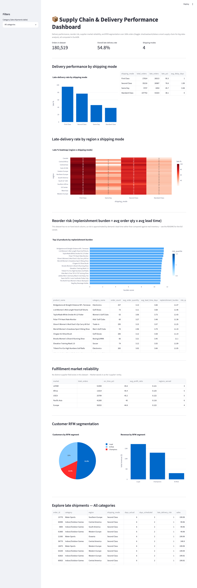

# 3. Supply Chain & Inventory Analysis

**Difficulty**: ⭐⭐⭐ (Intermediate) | **Est. time**: 3-4 weeks | **Best for**: operations focus, supply chain optimization

An operations-analytics project over 180,519 real orders: delivery performance, reorder-risk
scoring, fulfillment-market reliability, and RFM customer segmentation. Most DA portfolios only
cover customer-facing digital/retail data — this project deliberately goes deep on operations,
which is a genuine differentiator for retail, FMCG, logistics, and manufacturing employers.

## Problem statement
An operations team wants to know: which shipping modes are actually reliable (not just
premium-labeled), where late deliveries cluster geographically, which products carry the highest
replenishment burden, which fulfillment markets perform best, and which customers are most valuable
by recency/frequency/spend.

## Dataset
- **Kaggle**: [DataCo Smart Supply Chain](https://www.kaggle.com/datasets/shashwatwork/dataco-smart-supply-chain-for-big-data-analysis)
  (slug: `shashwatwork/dataco-smart-supply-chain-for-big-data-analysis` — matches the source doc exactly)
- **Domain**: operations, logistics & supply chain analytics
- **Size**: 180,519 orders, 53 columns (44 loaded — see note below)
- **Data-handling note**: the dataset ships fabricated-but-PII-shaped customer fields (email, name,
  password, street address). `db.py` drops them at load time — worth doing as a habit even on a
  synthetic teaching dataset.
- **Known gap**: there's no on-hand stock/inventory column, so a literal
  `(avg daily demand x lead time) > current stock` reorder alert (as sketched in some project
  write-ups of this idea) isn't computable here. This project approximates reorder *risk* with a
  replenishment-burden score instead — see the SQL comments for the full reasoning.

## Tech stack
| Layer | Tool |
|---|---|
| Storage / analysis | DuckDB (SQL) |
| Data access | Python (pandas, duckdb) |
| Visualisation (notebook) | Matplotlib, Seaborn |
| Visualisation (dashboard) | Streamlit, Plotly |

## How to run
```bash
# from the repo root, one-time setup (see root README for full details)
python -m venv .venv && source .venv/bin/activate
pip install -r requirements.txt

cd 03-supply-chain-analysis
python download_data.py        # pulls the dataset into ./data/ via the Kaggle API
jupyter notebook analysis.ipynb # walk through the analysis
streamlit run app.py            # or launch the interactive dashboard
```

## Architecture
SQL-first, same pattern as every project in this repo:
- [`queries.sql`](./queries.sql) — every analytical query, as named blocks.
- [`db.py`](./db.py) — loads `DataCoSupplyChainDataset.csv` into DuckDB (PII-shaped columns
  excluded), exposes `run_query()`.
- [`analysis.ipynb`](./analysis.ipynb) — narrative walkthrough with charts and interpretation.
- [`app.py`](./app.py) — Streamlit dashboard calling the same named queries.

## Key SQL concepts used
- `CASE WHEN` for on-time vs. late classification
- `NTILE(4)` for reorder-risk quartiles *and* for RFM quartile scoring
- Date parsing (`strptime`) and `DATE_DIFF` for recency calculations
- `CROSS JOIN` against a single-row aggregate (max order date) to compute recency per customer
- `GROUP BY ... HAVING` to filter out low-volume groups before ranking them
- Multi-key `GROUP BY` for a region x shipping-mode heatmap

## Analysis walkthrough & key findings
1. **Shipping-mode label ≠ reliability** — "First Class" has the *highest* late-delivery rate
   (95.3%), not the lowest; "Same Day" is the most reliable (45.7% late) and "Standard Class" the
   most punctual overall (38.1% late). The label appears to describe a paid service tier with a
   tight scheduled window, not the carrier's actual on-time performance — a reminder to verify
   labels against outcomes rather than assume "premium = better."
2. **Geography compounds the problem** — the region x shipping-mode heatmap shows late rates for
   First Class sitting at 90%+ almost everywhere, while Standard Class stays in the 30-40% range
   across most regions.
3. **Reorder risk** — approximated via a replenishment-burden score (avg order quantity x avg lead
   time) ranked into quartiles, since the dataset has no real stock column.
4. **Fulfillment markets** — on-time rate and average profit ratio are broadly similar across
   markets (~45% on-time, ~0.12 profit ratio), suggesting the late-delivery problem is systemic
   (shipping-mode/process related) rather than concentrated in one region's fulfillment operation.
5. **RFM segmentation** — "Loyal" and "Champions" customers, a minority by headcount, hold the
   majority of total revenue — a clear prioritization signal for a retention campaign.

## Skills demonstrated
- Date arithmetic and lead-time calculation from raw timestamp strings
- On-time/late classification and aggregate delay metrics
- `NTILE`-based risk scoring and RFM quartile segmentation
- Recognizing and explicitly documenting a data-availability gap (no stock column) instead of
  fabricating data to force a doc's exact query pattern
- Self-directed adaptation of a "supplier reliability" concept to the entity the data actually has
  (Market, not a distinct supplier table)
- Building a filterable operations dashboard on top of parameterized SQL

## Dashboard preview


## Why recruiters love it
Operations and supply-chain analytics is in high demand at retail, FMCG, and logistics companies,
and most DA candidates never touch it. The "First Class is actually the least reliable" finding is
a genuinely surprising, defensible insight — exactly the kind of thing that makes for a strong
interview story instead of a generic chart tour.
