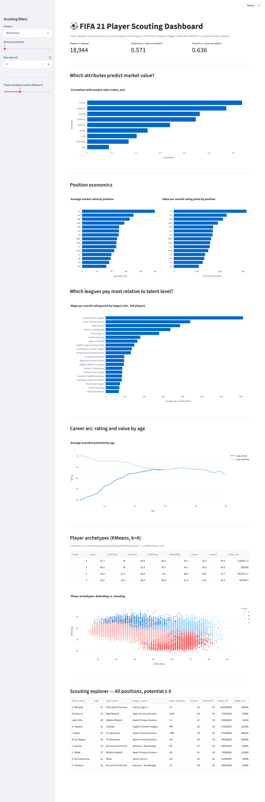

# 4. FIFA Player Performance Analysis

**Difficulty**: ⭐⭐⭐⭐ (Intermediate-Advanced) | **Est. time**: 3-4 weeks | **Best for**: clustering, multivariate analysis, ML intro

A player-valuation and scouting project over 18,944 FIFA 21 players. This is the first project in
the series that goes beyond SQL: KMeans clustering for player archetypes, and a regression to flag
under/overvalued players. Everything that *can* be done in SQL still is — clustering and regression
are the two places this project genuinely needs pandas/scikit-learn instead.

## Problem statement
A club's recruitment analytics team wants to understand what drives player market value, identify
natural player archetypes independent of the position label on a player's profile, see which
leagues overpay relative to talent level, and get a short list of players whose stats suggest
they're priced below what a simple model would predict.

## Dataset
- **Kaggle**: [FIFA 21 Complete Player Dataset](https://www.kaggle.com/datasets/stefanoleone992/fifa-21-complete-player-dataset)
  (slug: `stefanoleone992/fifa-21-complete-player-dataset` — matches the source doc)
- **Domain**: sports player valuation & scouting
- **Size**: the Kaggle archive ships FIFA 15-21 (7 CSVs + a large multi-year Excel workbook);
  `download_data.py` downloads the full archive and then deletes everything except
  `players_21.csv` (18,944 players, 106 columns) to keep `data/` small
- **Data quality note**: goalkeepers have no pace/shooting/passing/dribbling/defending/physic
  values (they have `gk_*` stats instead) — every outfield-attribute query filters
  `WHERE pace IS NOT NULL` to exclude the 2,083 goalkeepers from that analysis

## Tech stack
| Layer | Tool |
|---|---|
| Storage / analysis | DuckDB (SQL) |
| Data processing | Python (pandas, duckdb) |
| Clustering / modeling | scikit-learn (KMeans, LinearRegression) |
| Visualisation (notebook) | Matplotlib, Seaborn |
| Visualisation (dashboard) | Streamlit, Plotly |

## How to run
```bash
# from the repo root, one-time setup (see root README for full details)
python -m venv .venv && source .venv/bin/activate
pip install -r requirements.txt

cd 04-fifa-player-analysis
python download_data.py        # pulls players_21.csv into ./data/ via the Kaggle API
jupyter notebook analysis.ipynb # walk through the analysis, including the clustering
streamlit run app.py            # or launch the interactive scouting dashboard
```

## Architecture
SQL-first for everything except clustering/regression:
- [`queries.sql`](./queries.sql) — every SQL-expressible query, as named blocks.
- [`db.py`](./db.py) — loads `players_21.csv` into DuckDB, exposes `run_query()`.
- [`analysis.ipynb`](./analysis.ipynb) — narrative walkthrough: runs the named queries, then does
  the KMeans clustering and regression directly in pandas/scikit-learn on top of them.
- [`app.py`](./app.py) — Streamlit dashboard calling the same named queries, plus a live
  (cached) KMeans re-clustering with an adjustable `k` slider.

## Key concepts used
- SQL: `CORR()` per-attribute, `UNNEST`/`string_split` to explode multi-position players (same
  technique as the Zomato project's cuisine column), `GROUP BY ... HAVING` to drop low-sample groups
- KMeans clustering with the elbow method to choose `k`, on standardized features
  (`StandardScaler`) — unscaled clustering would let `value_eur`-scale features dominate
- Linear regression on `log(value_eur)` with residual analysis to flag under/overvalued players
- Explicitly stating a model's limitations (no club/league feature) rather than presenting its
  output as ground truth

## Analysis walkthrough & key findings
1. **What predicts value** — `overall` (r = 0.636) and `potential` (r = 0.571) are both strong,
   closely-matched predictors; passing and dribbling correlate with value more than defending does.
2. **Position economics** — attacking positions (CF, LW, RW) carry both the highest absolute
   average value and the highest value-per-overall-point — the market pays a premium for attacking
   output specifically, beyond what a raw overall rating would predict.
3. **League pay gap** — the English Premier League pays ~1.6-2x more per overall-rating point than
   Spain's Primera División or Italy's Serie A for comparable talent levels.
4. **Player archetypes** — KMeans (k=4, chosen via the elbow method) on 6 standardized attributes
   recovers a recognizable attacker / defender / all-rounder structure without ever being told a
   player's position — a good sanity check that the attributes carry real positional signal.
5. **Valuation regression** — a 3-feature model (overall, potential, age) reaches R² = 0.971, but
   `potential`'s coefficient shrinks to nearly 0 once `overall` is included (the two are highly
   collinear). The model has no club/league feature, so its "most undervalued" list leans toward
   decent players at smaller clubs rather than genuine hidden gems — a limitation worth stating
   explicitly rather than presenting the model's output as ground truth.

## Skills demonstrated
- Correlation analysis across multiple attributes against a single target
- Exploding a multi-valued column (again — same pattern as project 1, different dataset)
- K-means clustering, feature scaling, and the elbow method for choosing k
- Linear regression, residual analysis, and — just as important — recognizing and stating a
  model's blind spots instead of overselling its output
- Building an interactive dashboard with a *live*, user-adjustable ML parameter (the k slider)

## Dashboard preview


## Why recruiters love it
Athlete/sports data portfolio projects are uncommon, which sets this apart on its own — but more
importantly, this project demonstrates the full range from SQL aggregation through unsupervised
learning to a regression with honestly-stated limitations, showing both quantitative range and the
judgment to know when a model's output needs a caveat.
