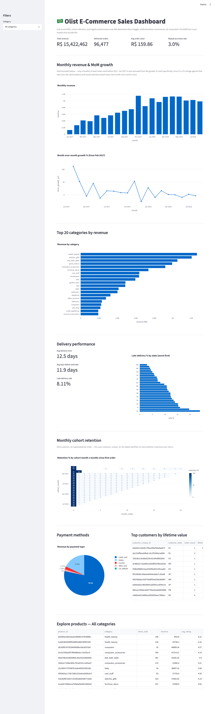

# 5. E-Commerce Sales Dashboard (Olist Brazilian E-Commerce) — Capstone

**Difficulty**: ⭐⭐⭐⭐ (Advanced) | **Est. time**: 4-6 weeks | **Best for**: complete DA workflow, interview showcase piece

The capstone project: a genuine multi-table ETL + KPI + cohort-retention + logistics analysis over
9 joined tables and ~100k real orders from a real Brazilian e-commerce marketplace. This is the
closest thing in the repo to what a data analyst actually does on day one of a new job.

## Problem statement
Leadership wants a single source of truth for core e-commerce KPIs (revenue, AOV, MoM growth),
answers on whether customers come back (retention/repeat-purchase), which product categories drive
revenue, and how logistics performance varies by region — built on top of properly joined,
production-shaped data rather than a single flat CSV.

## Dataset
- **Kaggle**: [Olist Brazilian E-Commerce](https://www.kaggle.com/datasets/olistbr/brazilian-ecommerce)
  (slug: `olistbr/brazilian-ecommerce` — matches the source doc)
- **Domain**: end-to-end e-commerce analytics & KPI tracking
- **Size**: 9 CSVs — orders, customers, order_items, order_payments, order_reviews, products,
  sellers, geolocation, category_translation — joined via `orders.order_id` /
  `order_items.product_id` / `customers.customer_id` / etc.
- **Schema gotcha worth knowing up front**: `customer_id` is generated *per order* in this dataset
  — a returning customer gets a brand-new `customer_id` every time they buy. The stable,
  person-level identifier is `customer_unique_id`. Every retention/CLV/repeat-purchase query in
  this project joins through `customer_unique_id`, not `customer_id` — get this wrong and repeat
  purchase rate silently looks like 0%.

## Tech stack
| Layer | Tool |
|---|---|
| Storage | DuckDB (persisted to a single `data/olist.duckdb` file) |
| ETL | Python (`load_to_duckdb.py`, ~40 lines) |
| Analysis | SQL (DuckDB dialect) |
| Visualisation (notebook) | Matplotlib, Seaborn |
| Visualisation (dashboard) | Streamlit, Plotly |

## How to run
This project has **one extra setup step** compared to the others in this repo — an explicit ETL
stage that loads all 9 CSVs into a single DuckDB file before any analysis runs:
```bash
# from the repo root, one-time setup (see root README for full details)
python -m venv .venv && source .venv/bin/activate
pip install -r requirements.txt

cd 05-olist-ecommerce-dashboard
python download_data.py         # pulls the 9 raw CSVs into ./data/ via the Kaggle API
python load_to_duckdb.py        # loads them into ./data/olist.duckdb (the doc's suggested ETL step)
jupyter notebook analysis.ipynb # walk through the analysis
streamlit run app.py            # or launch the interactive dashboard
```

## Architecture
SQL-first, same pattern as every project in this repo — with one difference: `db.py` connects to
the *persisted* `data/olist.duckdb` file built by `load_to_duckdb.py`, rather than loading CSVs
into an in-memory database on every run.
- [`load_to_duckdb.py`](./load_to_duckdb.py) — the ETL step: loads all 9 CSVs into one DuckDB file.
- [`queries.sql`](./queries.sql) — every analytical query, as named blocks.
- [`db.py`](./db.py) — connects to `olist.duckdb`, exposes `run_query()`.
- [`analysis.ipynb`](./analysis.ipynb) — narrative walkthrough with charts and interpretation.
- [`app.py`](./app.py) — Streamlit dashboard calling the same named queries.

## Key SQL concepts used
- `JOIN` across up to 5 tables in a single query (order_items → products → category_translation →
  order_reviews, etc.)
- `DATE_TRUNC()` for monthly aggregation, `DATE_DIFF()` for delivery-time and cohort-month-index calculations
- `LAG()` for month-over-month growth
- CTEs throughout to keep multi-step logic (cohort assignment, then cohort×month aggregation) readable
- `GROUP BY ... HAVING` to drop low-volume states before ranking them by late-delivery rate

## Analysis walkthrough & key findings
1. **Headline KPIs** — ~96.5k delivered orders, ~93.4k distinct customers, R$15.4M total revenue,
   R$159.86 average order value.
2. **Revenue trend** — steady growth through 2017, plateauing through most of 2018. The first two
   months of raw data (2016) are seed-data noise excluded from the trend chart, and the Jan 2017
   growth-% figure is excluded from the growth chart specifically since it's a % change against a
   near-zero December 2016 baseline that would otherwise dwarf every real month-over-month move —
   both judgment calls stated explicitly rather than silently applied.
3. **Category performance** — health_beauty, watches_gifts, and bed_bath_table lead by revenue.
4. **Logistics** — ~12.5 day average delivery time, ~8% late-delivery rate overall, but late rates
   vary 2-3x by state, concentrated in regions farther from the main São Paulo logistics hub.
5. **Retention — the standout finding** — only ~3% of customers ever place a second order,
   confirmed independently by both a repeat-purchase-rate query and a full cohort-retention heatmap
   (which drops to low single digits by month 1 for every cohort). This is a real, well-documented
   characteristic of the Olist marketplace, not a query bug — and it reframes the whole "growth"
   conversation: growth here is acquisition-driven, not retention-driven.

## Skills demonstrated
- Multi-table ETL: designing and running a load script rather than working from one flat file
- Correctly identifying and using the stable entity key (`customer_unique_id`) in a schema with a
  misleading trap (`customer_id`) — a very realistic "read the data dictionary" lesson
- Cohort-retention construction from raw order-level data (cohort assignment → month-index → pivot)
- Judgment calls on excluding misleading data points from a chart, stated explicitly rather than hidden
- Building a full multi-section KPI dashboard on top of parameterized, joined SQL

## Dashboard preview


## Why recruiters love it
This mirrors exactly what data analysts do on day one: multi-table wrangling, a real ETL step, and
stakeholder-ready visuals — not just a single-table EDA. A live, clickable dashboard gives
interviewers something tangible to explore during the conversation, and the retention finding (with
its "acquisition-driven, not retention-driven" reframe) is a genuine, defensible business insight
rather than a checklist of charts.
